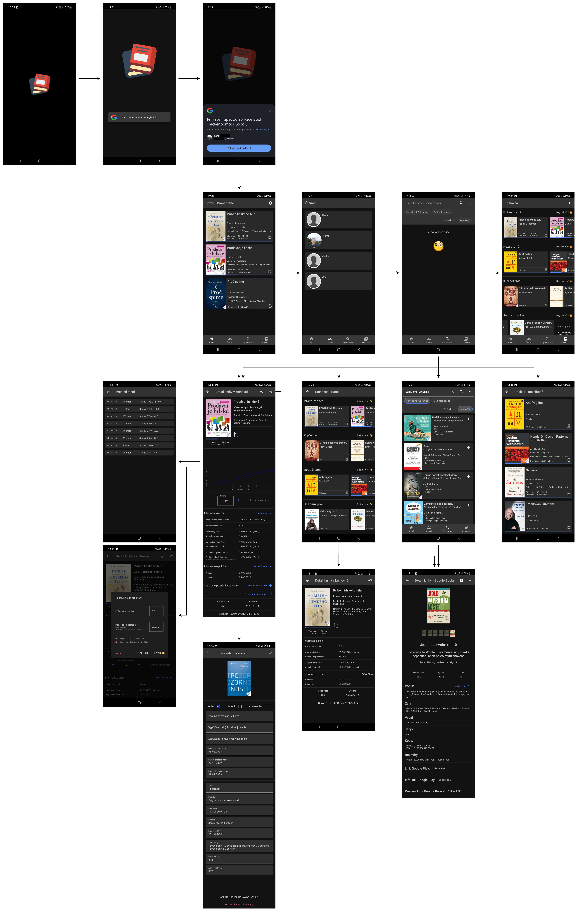

## BookTracker
Android Application for Book tracking and more.

### Used technologies:
- Android SDK
- Kotlin
- Kotlin coroutines
- Jetpack - Compose, DataStore, WorkManager, Navigation, ViewModel
- AlarmManager
- NotificationManager
- Dagger Hilt
- Google Identity (One Tap sign-In)
- Firebase - Authentication, Firestore, Storage, Crashlytics, Analytics, App Distribution
- Retrofit
- Coil
- JUnit

### Core app features:
- Sign-in via **Google Identity** (One-tap sign-in).
- Book search via **Google Books API** with **Retrofit**
- Saving user data to **Firebase Firestore.**

  - Adding book to library from Google Books repository.
  - Creating custom book by user (when book is not at Google Books repository).
  - Sorting books in library into bookshelves.
  - Tracking progress of user reading for each book (Start of reading, end of reading, reading speed, ...). Progress is visualised by a graph drawn on canvas.
  - Setting goal of reading for each book.
 
- Uploading image from **storage** for book cover.
  - Image is down-scaled and saved at **Firebase Storage.**
- **Notification** for reading reminder. Currently set to 18:00 daily with **AlarmManager.**

## Screenshots
[Screenshoty ZDE](Screenshots)

## UI FLOW

